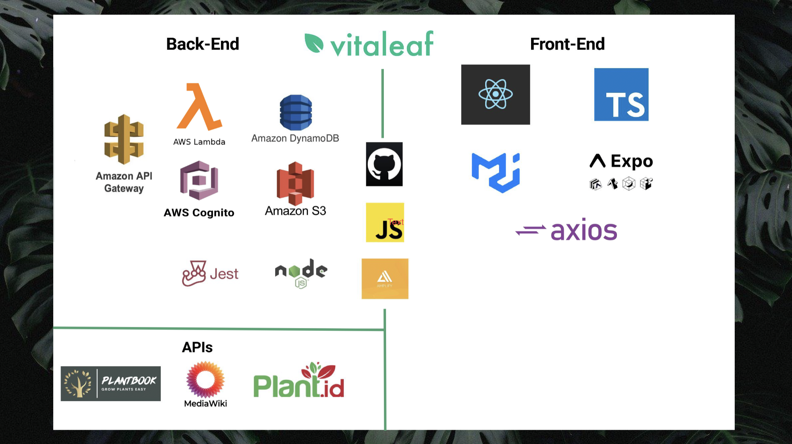

# Plant-Manager-App-BE

Welcome to Team 404's Back-End repository for our team's end of course project.
We are avid plant enthusiasts and wanted to create an application for mobile which could aid in the plant maintenance,
collection monitoring and care for an users plants.

The app allows an user to login, add plants to their collection, look up new plants, take a photo of a plant using the devices camera or from camera roll. This can then be used to add to the users single plant in their collection or using plant.id api find out using photo recognition what species of plant it is.
Our back-end api, built using AWS then will match the most likely plant to our database (using Dynamo DB) to tell the user information about the plant, including light/shade needs and watering requirements. The user can then mark a plant as watered and the app will tell them when that plant next needs to be watered based upon its category and its plant data.

For the back-end development of our app we used dynamo-DB as it allowed a more flexible data structure which led to using further amazon web services including API Gateway to host and set up our API endpoints, Cognito for user verification which is directly linked to our user database, Amplify to link our front-end user creation to Cognito , AWS S3 allowed us the ability to store user-uploaded images and finally AWS Lambda functions to trigger interactions between AWS services.

**Project Tech Stack:**


### Front-End

The Front-End was built using React Native, Expo, Axios and AWS Amplify.
<br />
Link for Front-End:
[Front-End Repository](https://github.com/Elbeera/Plant-Manager-App-FE)

## BETA

https://l81eyc3fja.execute-api.eu-west-2.amazonaws.com/beta

## Current Endpoints

```http
GET /plants
    ?category={category}
    ?search={filters common and botanical names using regex}

GET /plants/{commonName}

GET /users

POST /users
    { username, email }

GET /users/{username}

PATCH /users/{username}
    { newUserName }

GET /users/{username}/plants

POST /users/{username}/plants
    { nickName, commonName }

GET /users/{username}/plants/{nickname}

DELETE /users/{username}/plants/{nickname}

PATCH /users/{username}/plants/{nickname}
    { newNickName }

```
